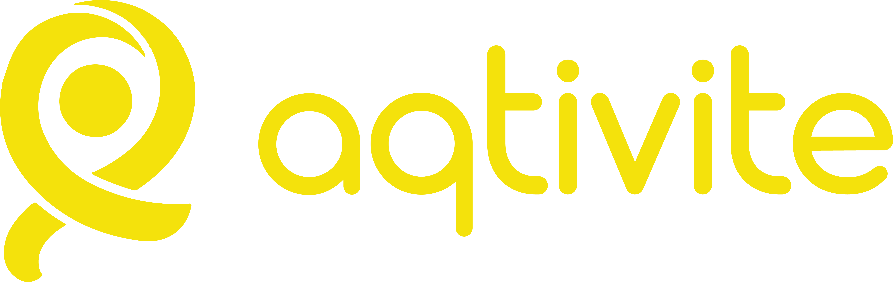

# Hi, I'm Mehmet ÖĞMEN 👋

**Backend developer & DevOps enthusiast from Türkiye.**
PHP / Laravel by day, Docker & shell scripts by night, building small focused tools that do one thing well.

---

## 🛠 What I work on

I split my open-source work across a handful of GitHub organizations — each focused on one technology, each holding small, well-named, single-purpose repositories instead of one giant monorepo. The shared philosophy across all of them:

> **One concern, one repo. Short, readable, replaceable.**

I prefer narrow scopes, clean conventions, and code you can grasp in one sitting. Less framework magic, more boring reliable parts.

---

## 🏛 My organizations

<table>
<tr>
<td align="center" width="50%">

### [x-laravel](https://github.com/x-laravel)
**Focused, tested, well-maintained Laravel packages.**
Vector embeddings for Eloquent, polymorphic commentables, approval workflows, settings, Pulse integrations, and Turkish-specific validators.

</td>
<td align="center" width="50%">

### [x-dockerize](https://github.com/x-dockerize)
**Production-ready Docker setups.**
Shared multi-arch PHP base images on GHCR + Compose templates for everything I self-host — databases, mail, VPN, collaboration, ops.

</td>
</tr>
<tr>
<td align="center" width="50%">

### [x-shell-codes](https://github.com/x-shell-codes)
**Single-purpose shell scripts for Ubuntu provisioning.**
Open the file. Read it. Run it. Move on. Nginx, MySQL, Redis, PHP, Node.js, SSL — one concern per repo.

</td>
<td align="center" width="50%">

### [x-app-run](https://github.com/x-app-run) · [x-app.run](https://x-app.run)
**100+ free web utilities, all in your browser.**
JSON beautifier, SSL checker, QR generator, encoders, converters — one focused page per tool. No installs, no accounts.

</td>
</tr>
<tr>
<td align="center" width="50%">

### [weld.ist](https://github.com/weldist)
**Welding missing pieces onto big open source packages.**
Small, focused, reversible Composer packages that bolt onto upstream extension points — currently `spatie/laravel-medialibrary` and `laravel/pulse` add-ons.

</td>
<td align="center" width="50%">

### [Aqtivite](https://github.com/aqtivite)
**Discover what's happening in your city.**
A mobile app that surfaces nearby activities, events, and places worth your time — built for everyday discovery.

</td>
</tr>
<tr>
<td align="center" colspan="2">

### Other orgs

**[bulutsis](https://github.com/bulutsis)** — cloud-side experiments · **[ValueObjects](https://github.com/ValueObjects)** — typed value object collection

Smaller orgs holding focused experiments and shared utilities.

</td>
</tr>
</table>

---

## 🧰 Stack & tools

**Backend:** PHP 8 · Laravel 10–13 · MySQL / PostgreSQL / MongoDB · Redis
**Infra:** Docker · Traefik · GHCR · Ubuntu · Nginx · Certbot
**Scripting:** Bash · Composer · Supervisor
**Frontend (light):** Blade · Livewire · Next.js · Vue
**Tools I keep coming back to:** Vagrant · n8n · Pulse · Plane · Mailpit

---

## 🇹🇷 Turkish locale work

Long-running side interest: making PHP libraries actually behave correctly with Turkish characters and Turkish government IDs. A small but stable set of packages used by Turkish PHP devs:

- [tr-string](https://github.com/X-Adam/tr-string) — Turkish-aware string case conversion (the dotted-I / dotless-ı problem)
- [tr-citizen-number-validation](https://github.com/X-Adam/tr-citizen-number-validation) / [-verification](https://github.com/X-Adam/tr-citizen-number-verification) — TC kimlik no
- [tr-tax-number-validation](https://github.com/X-Adam/tr-tax-number-validation) / [-verification](https://github.com/X-Adam/tr-tax-number-verification) / [-faker](https://github.com/X-Adam/tr-tax-number-faker) — vergi numarası
- [php-string](https://github.com/X-Adam/php-string) — general PHP string helper

> Most of these are now reborn under [x-laravel](https://github.com/x-laravel) as proper Laravel packages with full test coverage.

---

## 📫 Get in touch

 

Open to issues and PRs on any active repo. Bug reports go on the relevant repo, not here.

